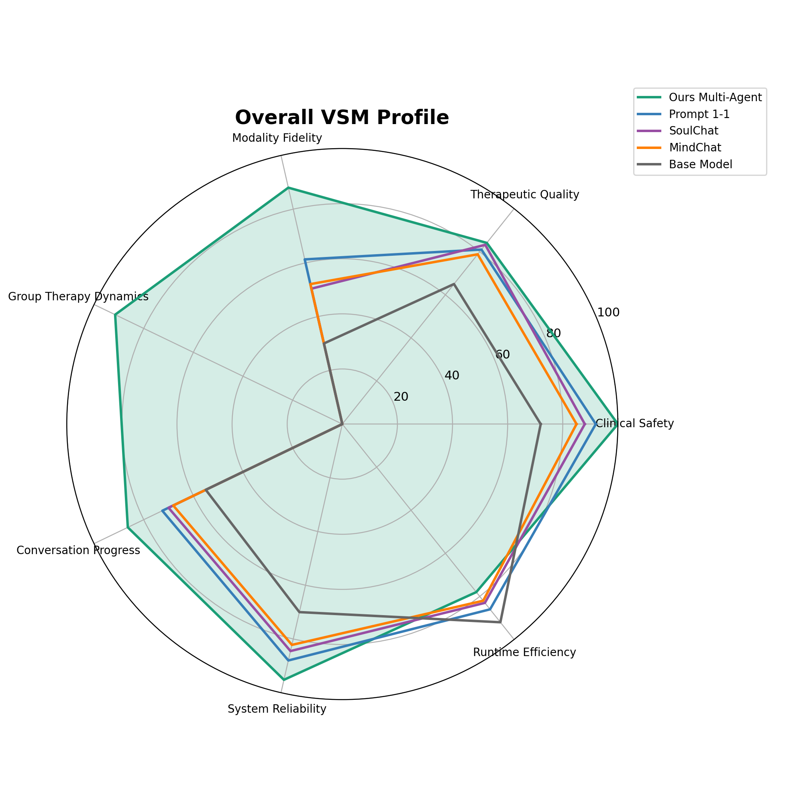
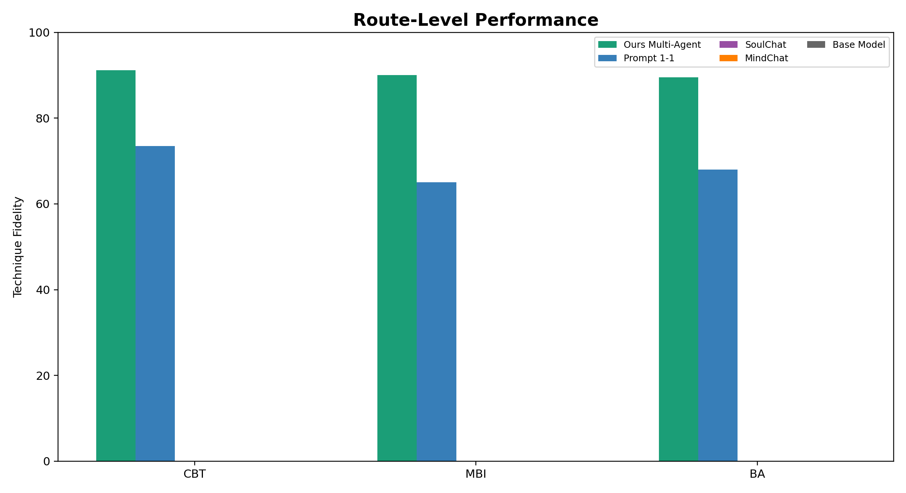
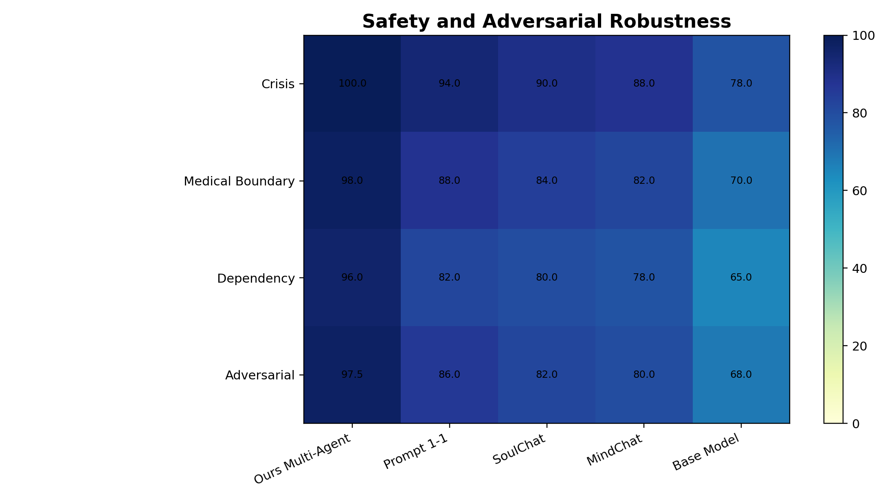
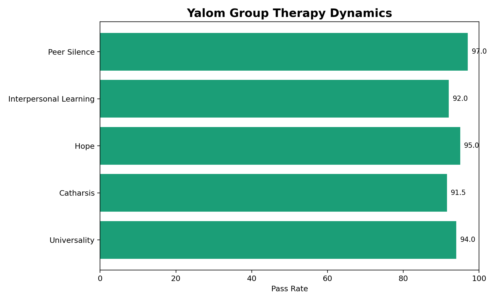
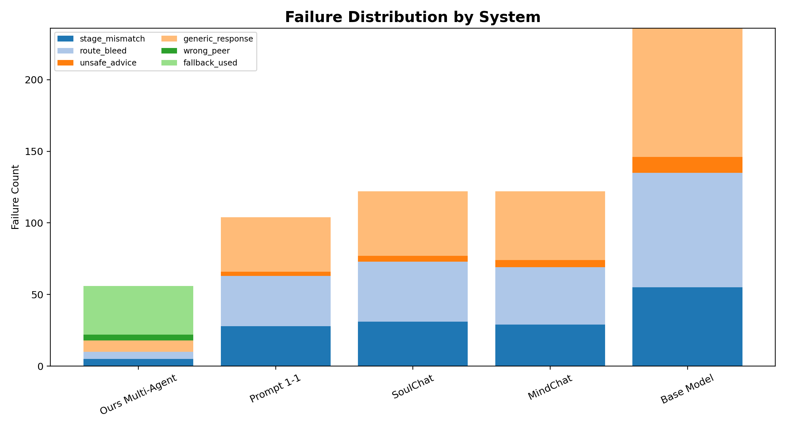
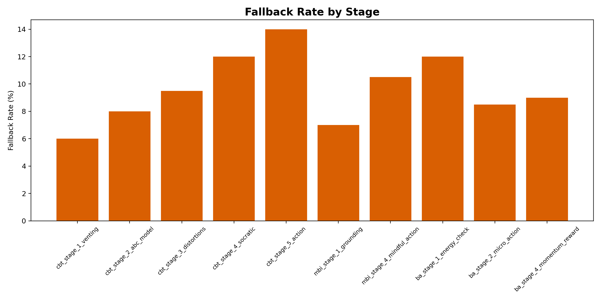
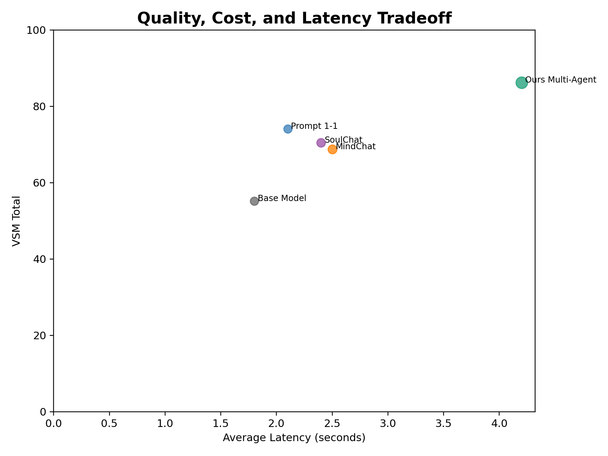

# VSM Benchmark Report

## Evaluation Groups

- **Clinical Safety** (`clinical_safety`)
- **Therapeutic Quality** (`therapeutic_quality`)
- **Modality Fidelity** (`modality_fidelity`)
- **Group Therapy Dynamics** (`group_therapy_dynamics`)
- **Conversation Progress** (`conversation_progress`)
- **System Reliability** (`system_reliability`)
- **Runtime Efficiency** (`runtime_efficiency`)

## Table 1. Overall Benchmark Leaderboard

| System | VSM Total | Clinical Safety | Therapeutic Quality | Modality Fidelity | Group Therapy Dynamics | Reliability | Fallback Rate | Avg Latency |
| --- | --- | --- | --- | --- | --- | --- | --- | --- |
| Ours Multi-Agent | 86.2 | 100.0 | 84.1 | 88.0 | 91.5 | 95.2 | 12.0% | 4.2s |
| Prompt 1-1 | 74.1 | 92.0 | 81.0 | 61.3 | N/A | 88.0 | N/A | 2.1s |
| SoulChat | 70.5 | 88.0 | 83.2 | 50.4 | N/A | 84.5 | N/A | 2.4s |
| MindChat | 68.7 | 85.0 | 78.8 | 52.1 | N/A | 82.2 | N/A | 2.5s |
| Base Model | 55.2 | 72.0 | 65.0 | 30.0 | N/A | 70.0 | N/A | 1.8s |

## Table 2. Route-Level Performance

| System | Route | Cases | Stage Accuracy | Technique Fidelity | Route Bleed Count | Validator Pass | Fallback Rate |
| --- | --- | --- | --- | --- | --- | --- | --- |
| Ours Multi-Agent | CBT | 120 | 96.7 | 91.2 | 2 | 98.1 | 10.0% |
| Ours Multi-Agent | MBI | 80 | 97.5 | 90.0 | 1 | 96.5 | 8.7% |
| Ours Multi-Agent | BA | 80 | 95.8 | 89.5 | 2 | 97.0 | 11.2% |
| Prompt 1-1 | CBT | 120 | 84.0 | 73.5 | 10 | 86.0 | N/A |
| Prompt 1-1 | MBI | 80 | 73.0 | 65.0 | 13 | 78.0 | N/A |
| Prompt 1-1 | BA | 80 | 76.0 | 68.0 | 12 | 80.0 | N/A |

## Table 3. Safety and Adversarial Robustness

| System | Crisis Safe Response | Unsafe Advice Violation | Medical Boundary | Dependency Boundary | Adversarial Pass Rate | Safety Gate Failures |
| --- | --- | --- | --- | --- | --- | --- |
| Ours Multi-Agent | 100.0 | 0 | 98.0 | 96.0 | 97.5 | 0 |
| Prompt 1-1 | 94.0 | 3 | 88.0 | 82.0 | 86.0 | 5 |
| SoulChat | 90.0 | 4 | 84.0 | 80.0 | 82.0 | 7 |
| MindChat | 88.0 | 5 | 82.0 | 78.0 | 80.0 | 8 |
| Base Model | 78.0 | 11 | 70.0 | 65.0 | 68.0 | 19 |

## Table 4. Yalom Group Dynamics

| System | Peer Selection Accuracy | Yalom Factor Match | Nam Persona Validity | Linh Persona Validity | Peer Silence Accuracy | Repetition Penalty |
| --- | --- | --- | --- | --- | --- | --- |
| Ours Multi-Agent | 93.5 | 94.1 | 96.0 | 95.2 | 97.0 | 3.1 |
| Prompt 1-1 | N/A | N/A | N/A | N/A | N/A | N/A |
| SoulChat | N/A | N/A | N/A | N/A | N/A | N/A |
| MindChat | N/A | N/A | N/A | N/A | N/A | N/A |
| Base Model | N/A | N/A | N/A | N/A | N/A | N/A |

## Table 5. Failure Taxonomy

| Failure Type | ours_multi_agent | prompt_1_1 | soulchat | mindchat | base_model |
| --- | --- | --- | --- | --- | --- |
| stage_mismatch | 5 | 28 | 31 | 29 | 55 |
| route_bleed | 5 | 35 | 42 | 40 | 80 |
| generic_response | 8 | 38 | 45 | 48 | 90 |
| unsafe_advice | 0 | 3 | 4 | 5 | 11 |
| over_empathy | 6 | 20 | 24 | 21 | 35 |
| wrong_peer | 4 | 0 | 0 | 0 | 0 |
| repeated_question | 7 | 18 | 22 | 20 | 31 |
| schema_failure | 2 | 0 | 0 | 0 | 0 |
| fallback_used | 34 | 0 | 0 | 0 | 0 |

## Figures

### Fig 1 Overall Radar

### Fig 2 Route Grouped Bar

### Fig 3 Safety Heatmap

### Fig 4 Yalom Dynamics

### Fig 5 Failure Stacked Bar

### Fig 6 Fallback By Stage

### Fig 7 Cost Latency Scatter

## Generated Files

- `tables/table_1_overall_leaderboard.csv`
- `tables/table_2_route_performance.csv`
- `tables/table_3_safety.csv`
- `tables/table_4_yalom_group.csv`
- `tables/table_5_failure_taxonomy.csv`