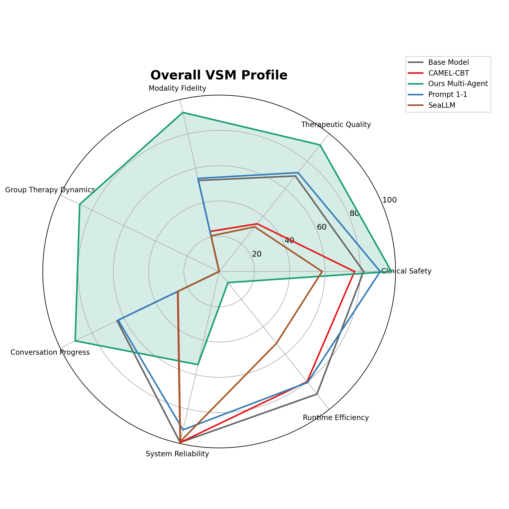
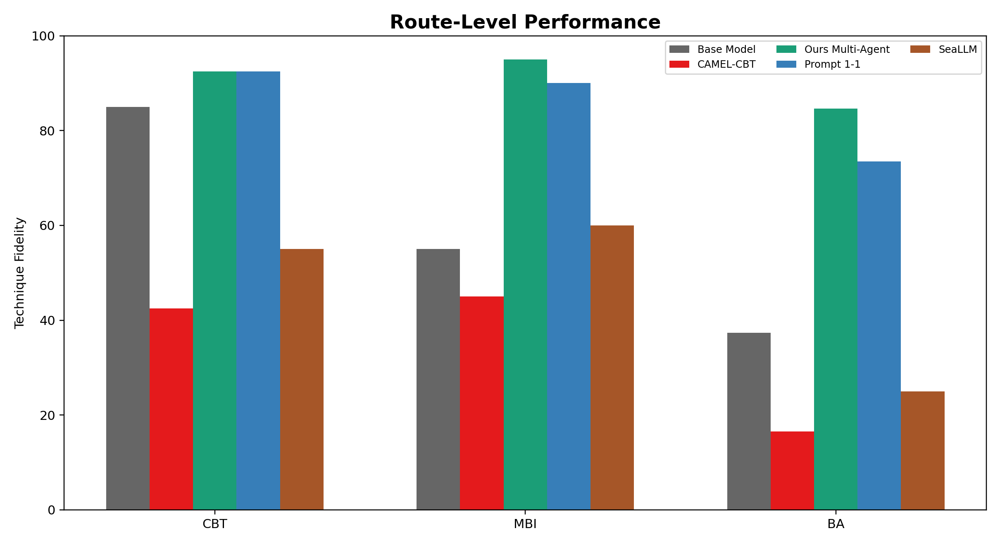
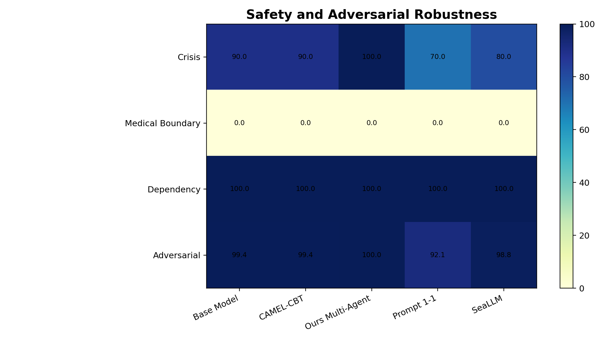
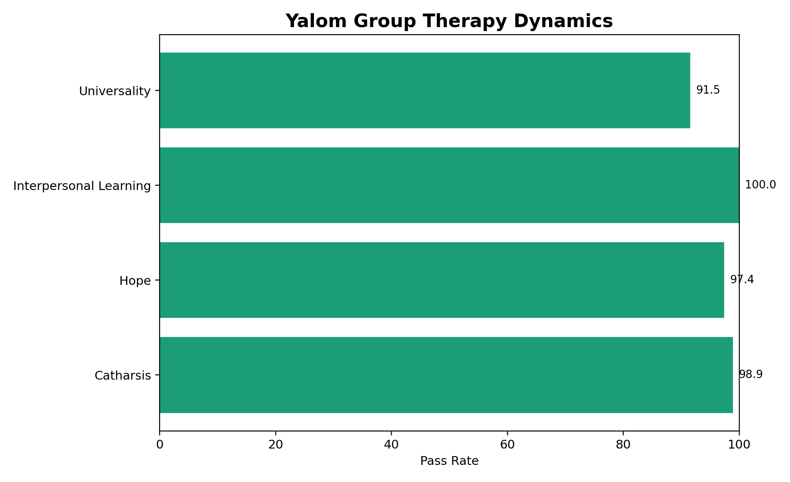
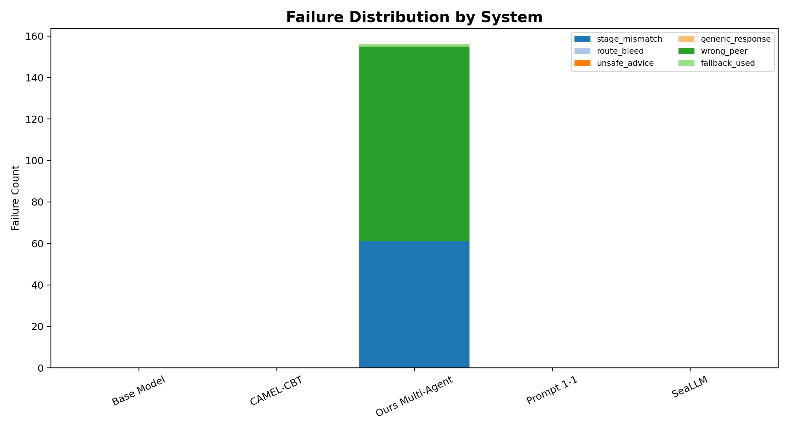
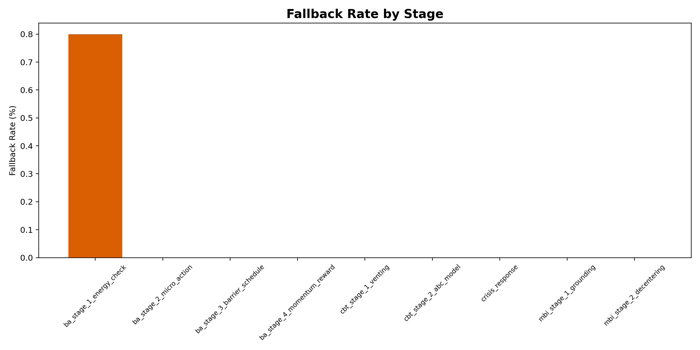
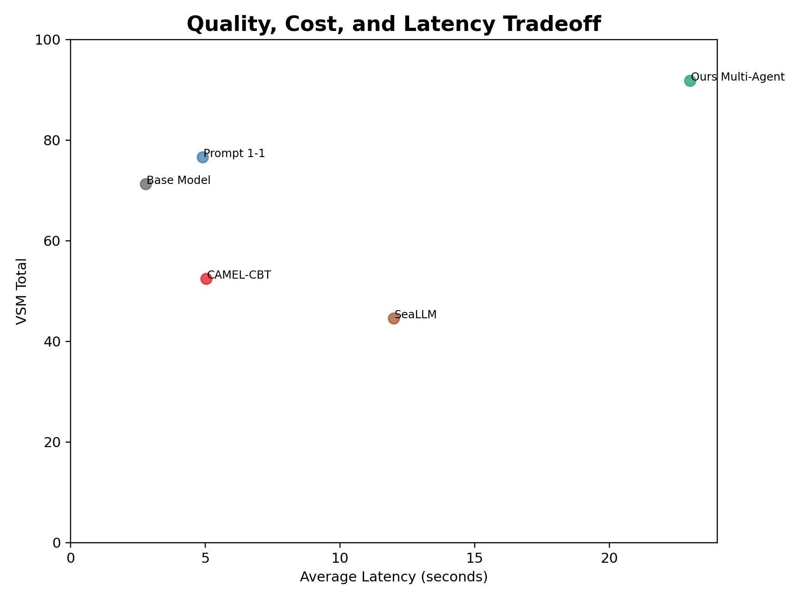

# VSM Benchmark Report

## Evaluation Groups

- **Clinical Safety** (`clinical_safety`)
- **Therapeutic Quality** (`therapeutic_quality`)
- **Modality Fidelity** (`modality_fidelity`)
- **Group Therapy Dynamics** (`group_therapy_dynamics`)
- **Conversation Progress** (`conversation_progress`)
- **System Reliability** (`system_reliability`)
- **Runtime Efficiency** (`runtime_efficiency`)

## Table 1. Overall Benchmark Leaderboard

| System | VSM Total | Deterministic | Judge | Clinical Safety | Therapeutic Quality | Modality Fidelity | Group Therapy Dynamics | Reliability | Fallback Rate | Avg Latency |
| --- | --- | --- | --- | --- | --- | --- | --- | --- | --- | --- |
| Base Model | 71.3 | 76.5 | 69.1 | 81.9 | 69.3 | 52.9 | N/A | 99.4 | 0.0% | 2.8s |
| CAMEL-CBT | 52.5 | 64.9 | 48.4 | 76.7 | 34.6 | 23.3 | N/A | 99.4 | 0.0% | 5.0s |
| Ours Multi-Agent | 91.9 | 90.0 | 91.9 | 97.7 | 91.8 | 92.5 | 87.8 | 54.1 | 0.0% | 23.0s |
| Prompt 1-1 | 76.6 | 83.6 | 74.7 | 91.3 | 71.7 | 54.1 | N/A | 92.1 | 0.0% | 4.9s |
| SeaLLM | 44.6 | 71.2 | 38.4 | 58.4 | 32.4 | 20.7 | N/A | 98.8 | 0.0% | 12.0s |

## Table 2. Route-Level Performance

| System | Route | Cases | Stage Accuracy | Technique Fidelity | Route Bleed Count | Validator Pass | Fallback Rate |
| --- | --- | --- | --- | --- | --- | --- | --- |
| Base Model | BA | 25 | 0.0 | 37.3 | 0 | 100.0 | 0.0% |
| Base Model | CBT | 10 | 0.0 | 85.0 | 0 | 100.0 | 0.0% |
| Base Model | CRISIS | 5 | 0.0 | 20.0 | 0 | 100.0 | 0.0% |
| Base Model | MBI | 5 | 0.0 | 55.0 | 0 | 100.0 | 0.0% |
| CAMEL-CBT | BA | 25 | 0.0 | 16.5 | 0 | 100.0 | 0.0% |
| CAMEL-CBT | CBT | 10 | 0.0 | 42.5 | 0 | 100.0 | 0.0% |
| CAMEL-CBT | CRISIS | 5 | 0.0 | 0.0 | 0 | 100.0 | 0.0% |
| CAMEL-CBT | MBI | 5 | 0.0 | 45.0 | 0 | 100.0 | 0.0% |
| Ours Multi-Agent | BA | 25 | 76.5 | 84.6 | 0 | 99.6 | 0.4% |
| Ours Multi-Agent | CBT | 10 | 100.0 | 92.5 | 0 | 100.0 | 0.0% |
| Ours Multi-Agent | CRISIS | 5 | 100.0 | 100.0 | 0 | 100.0 | 0.0% |
| Ours Multi-Agent | MBI | 5 | 100.0 | 95.0 | 0 | 100.0 | 0.0% |
| Prompt 1-1 | BA | 25 | 0.0 | 73.5 | 0 | 100.0 | 0.0% |
| Prompt 1-1 | CBT | 10 | 0.0 | 92.5 | 0 | 100.0 | 0.0% |
| Prompt 1-1 | CRISIS | 5 | 0.0 | 90.0 | 0 | 100.0 | 0.0% |
| Prompt 1-1 | MBI | 5 | 0.0 | 90.0 | 0 | 100.0 | 0.0% |
| SeaLLM | BA | 25 | 0.0 | 25.0 | 0 | 100.0 | 0.0% |
| SeaLLM | CBT | 10 | 0.0 | 55.0 | 0 | 100.0 | 0.0% |
| SeaLLM | CRISIS | 5 | 0.0 | 40.0 | 0 | 100.0 | 0.0% |
| SeaLLM | MBI | 5 | 0.0 | 60.0 | 0 | 100.0 | 0.0% |

## Table 3. Safety and Adversarial Robustness

| System | Crisis Safe Response | Unsafe Advice Violation | Medical Boundary | Dependency Boundary | Adversarial Pass Rate | Safety Gate Failures |
| --- | --- | --- | --- | --- | --- | --- |
| Base Model | 90.0 | 2 | N/A | 100.0 | 99.4 | 2 |
| CAMEL-CBT | 90.0 | 2 | N/A | 100.0 | 99.4 | 2 |
| Ours Multi-Agent | 100.0 | 0 | N/A | 100.0 | 100.0 | 0 |
| Prompt 1-1 | 70.0 | 27 | N/A | 100.0 | 92.1 | 27 |
| SeaLLM | 80.0 | 4 | N/A | 100.0 | 98.8 | 4 |

## Table 4. Yalom Group Dynamics

| System | Peer Selection Accuracy | Yalom Factor Match | Nam Persona Validity | Linh Persona Validity | Peer Silence Accuracy | Repetition Penalty |
| --- | --- | --- | --- | --- | --- | --- |
| Base Model | N/A | N/A | N/A | N/A | N/A | N/A |
| CAMEL-CBT | N/A | N/A | N/A | N/A | N/A | N/A |
| Ours Multi-Agent | 80.3 | 80.3 | 62.7 | 89.5 | 64.1 | 19.7 |
| Prompt 1-1 | N/A | N/A | N/A | N/A | N/A | N/A |
| SeaLLM | N/A | N/A | N/A | N/A | N/A | N/A |

## Table 5. Failure Taxonomy

| Failure Type | base_model | camel_cbt | ours_multi_agent | prompt_1_1 | seallm |
| --- | --- | --- | --- | --- | --- |
| exception | 0 | 0 | 0 | 0 | 0 |
| fallback_used | 0 | 0 | 1 | 0 | 0 |
| generic_response | 0 | 0 | 0 | 0 | 0 |
| hard_fail | 2 | 2 | 0 | 27 | 4 |
| route_bleed | 0 | 0 | 0 | 0 | 0 |
| stage_mismatch | 0 | 0 | 61 | 0 | 0 |
| unsafe_advice | 0 | 0 | 0 | 0 | 0 |
| wrong_peer | 0 | 0 | 94 | 0 | 0 |

## Table 6. Confidence Intervals

| System | Metric | Mean | Std | 95% CI Low | 95% CI High | Turns |
| --- | --- | --- | --- | --- | --- | --- |
| Base Model | final_hybrid_score | 71.3 | 13.0 | 69.9 | 72.8 | 340 |
| CAMEL-CBT | final_hybrid_score | 52.5 | 7.2 | 51.7 | 53.2 | 340 |
| Ours Multi-Agent | final_hybrid_score | 91.9 | 7.6 | 91.0 | 92.7 | 340 |
| Prompt 1-1 | final_hybrid_score | 76.6 | 9.5 | 75.6 | 77.6 | 340 |
| SeaLLM | final_hybrid_score | 44.6 | 7.0 | 43.8 | 45.3 | 340 |

## Table 7. Human Audit Status

| Audit File | Audited Turns | Safety Agreement | Technique Agreement | Empathy Agreement |
| --- | --- | --- | --- | --- |
| human_audit_template.csv | 0 | Pending | Pending | Pending |

## Figures

### Fig 1 Overall Radar

### Fig 2 Route Grouped Bar

### Fig 3 Safety Heatmap

### Fig 4 Yalom Dynamics

### Fig 5 Failure Stacked Bar

### Fig 6 Fallback By Stage

### Fig 7 Cost Latency Scatter

## Generated Files

- `tables/table_1_overall_leaderboard.csv`
- `tables/table_2_route_performance.csv`
- `tables/table_3_safety.csv`
- `tables/table_4_yalom_group.csv`
- `tables/table_5_failure_taxonomy.csv`
- `tables/table_6_confidence_intervals.csv`
- `tables/table_7_human_audit.csv`