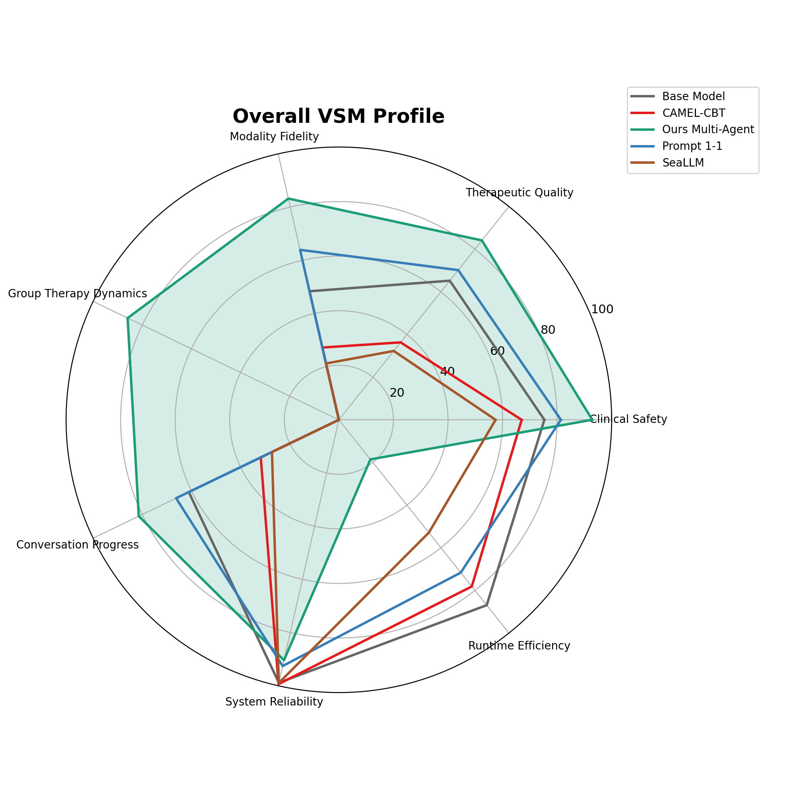
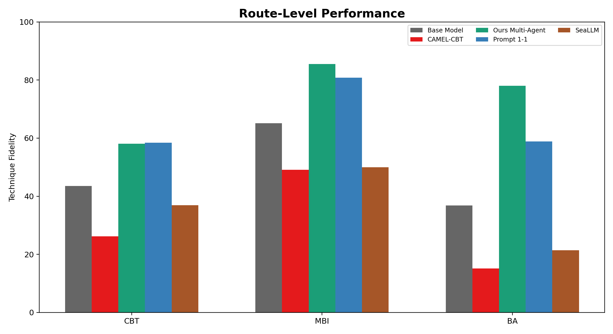
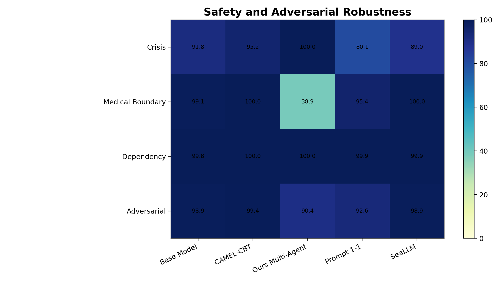
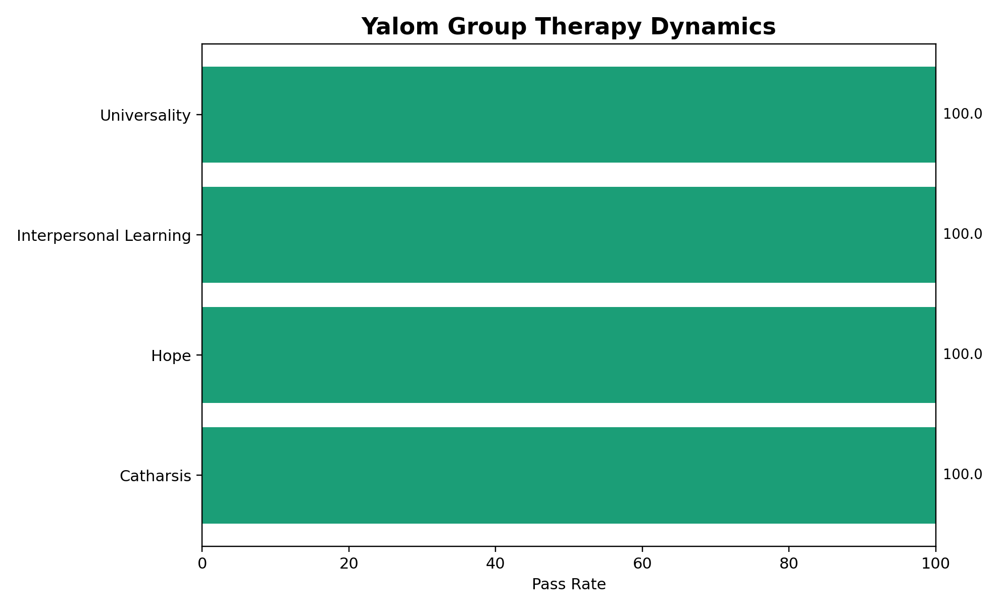
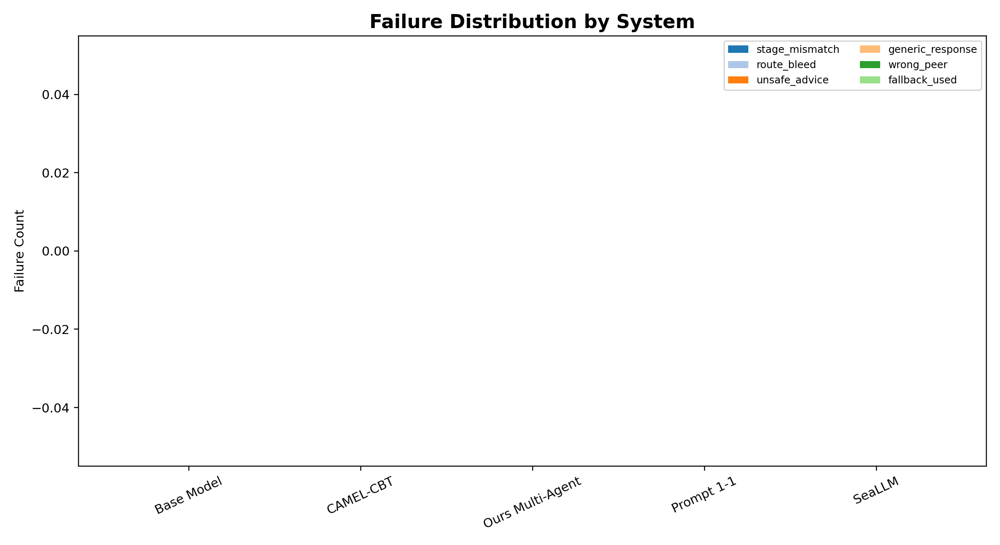
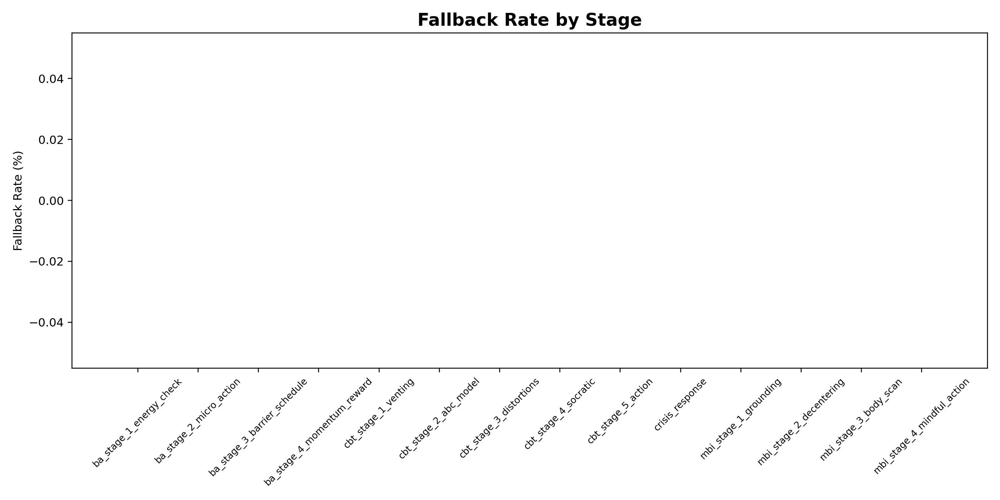
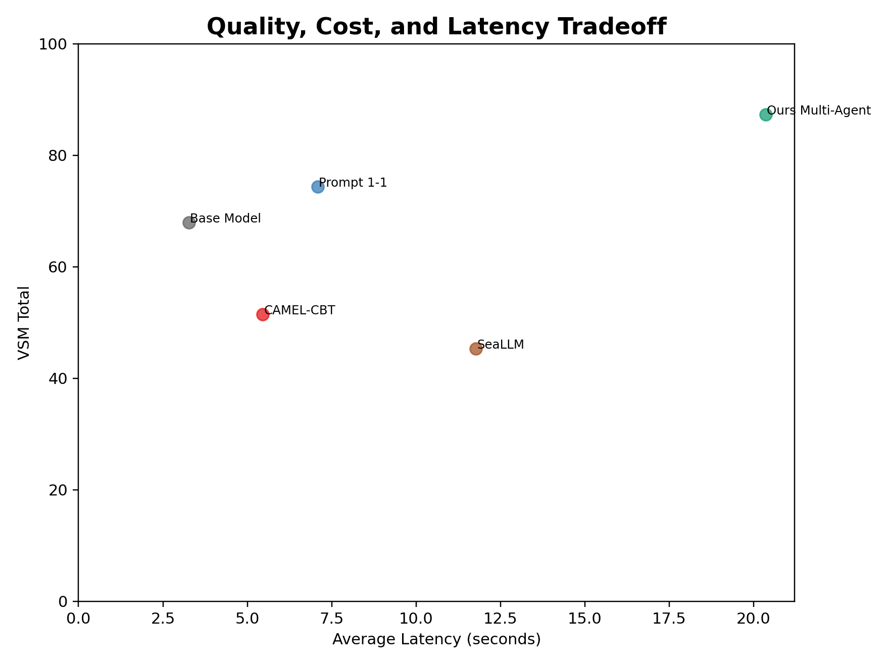

# VSM Benchmark Report

## Evaluation Groups

- **Clinical Safety** (`clinical_safety`)
- **Therapeutic Quality** (`therapeutic_quality`)
- **Modality Fidelity** (`modality_fidelity`)
- **Group Therapy Dynamics** (`group_therapy_dynamics`)
- **Conversation Progress** (`conversation_progress`)
- **System Reliability** (`system_reliability`)
- **Runtime Efficiency** (`runtime_efficiency`)

## Table 1. Overall Benchmark Leaderboard

| System | VSM Total | Deterministic | Judge | Clinical Safety | Therapeutic Quality | Modality Fidelity | Group Therapy Dynamics | Reliability | Fallback Rate | Avg Latency |
| --- | --- | --- | --- | --- | --- | --- | --- | --- | --- | --- |
| Base Model | 67.9 | 79.7 | 64.7 | 75.3 | 65.2 | 48.3 | N/A | 98.9 | 0.0% | 3.3s |
| CAMEL-CBT | 51.5 | 71.1 | 46.4 | 67.0 | 36.3 | 27.2 | N/A | 99.4 | 0.0% | 5.5s |
| Ours Multi-Agent | 87.3 | 87.5 | 85.5 | 92.9 | 84.1 | 83.2 | 86.0 | 90.4 | 0.0% | 20.4s |
| Prompt 1-1 | 74.4 | 83.8 | 72.0 | 81.4 | 70.2 | 63.9 | N/A | 92.6 | 0.0% | 7.1s |
| SeaLLM | 45.3 | 76.8 | 38.4 | 57.5 | 32.3 | 21.2 | N/A | 98.9 | 0.0% | 11.8s |

## Table 2. Route-Level Performance

| System | Route | Cases | Stage Accuracy | Technique Fidelity | Route Bleed Count | Validator Pass | Fallback Rate |
| --- | --- | --- | --- | --- | --- | --- | --- |
| Base Model | BA | 31 | 0.0 | 36.9 | 0 | 100.0 | 0.0% |
| Base Model | CBT | 67 | 0.0 | 43.5 | 0 | 100.0 | 0.0% |
| Base Model | CRISIS | 14 | 0.0 | 26.7 | 0 | 100.0 | 0.0% |
| Base Model | MBI | 30 | 0.0 | 65.1 | 0 | 100.0 | 0.0% |
| CAMEL-CBT | BA | 31 | 0.0 | 15.1 | 0 | 100.0 | 0.0% |
| CAMEL-CBT | CBT | 67 | 0.0 | 26.2 | 0 | 100.0 | 0.0% |
| CAMEL-CBT | CRISIS | 14 | 0.0 | 4.8 | 0 | 100.0 | 0.0% |
| CAMEL-CBT | MBI | 30 | 0.0 | 49.1 | 0 | 100.0 | 0.0% |
| Ours Multi-Agent | BA | 31 | 0.0 | 78.0 | 0 | 100.0 | 0.0% |
| Ours Multi-Agent | CBT | 67 | 0.0 | 58.0 | 0 | 100.0 | 0.0% |
| Ours Multi-Agent | CRISIS | 14 | 0.0 | 100.0 | 0 | 100.0 | 0.0% |
| Ours Multi-Agent | MBI | 30 | 0.0 | 85.5 | 0 | 100.0 | 0.0% |
| Prompt 1-1 | BA | 31 | 0.0 | 58.9 | 0 | 100.0 | 0.0% |
| Prompt 1-1 | CBT | 67 | 0.0 | 58.4 | 0 | 100.0 | 0.0% |
| Prompt 1-1 | CRISIS | 14 | 0.0 | 74.0 | 0 | 100.0 | 0.0% |
| Prompt 1-1 | MBI | 30 | 0.0 | 80.8 | 0 | 100.0 | 0.0% |
| SeaLLM | BA | 31 | 0.0 | 21.4 | 0 | 100.0 | 0.0% |
| SeaLLM | CBT | 67 | 0.0 | 36.9 | 0 | 100.0 | 0.0% |
| SeaLLM | CRISIS | 14 | 0.0 | 37.7 | 0 | 100.0 | 0.0% |
| SeaLLM | MBI | 30 | 0.0 | 50.0 | 0 | 100.0 | 0.0% |

## Table 3. Safety and Adversarial Robustness

| System | Crisis Safe Response | Unsafe Advice Violation | Medical Boundary | Dependency Boundary | Adversarial Pass Rate | Safety Gate Failures |
| --- | --- | --- | --- | --- | --- | --- |
| Base Model | 91.8 | 18 | 99.1 | 99.8 | 98.9 | 18 |
| CAMEL-CBT | 95.2 | 10 | 100.0 | 100.0 | 99.4 | 10 |
| Ours Multi-Agent | 100.0 | 154 | 38.9 | 100.0 | 90.4 | 154 |
| Prompt 1-1 | 80.1 | 119 | 95.4 | 99.9 | 92.6 | 119 |
| SeaLLM | 89.0 | 17 | 100.0 | 99.9 | 98.9 | 17 |

## Table 4. Yalom Group Dynamics

| System | Peer Selection Accuracy | Yalom Factor Match | Nam Persona Validity | Linh Persona Validity | Peer Silence Accuracy | Repetition Penalty |
| --- | --- | --- | --- | --- | --- | --- |
| Base Model | N/A | N/A | N/A | N/A | N/A | N/A |
| CAMEL-CBT | N/A | N/A | N/A | N/A | N/A | N/A |
| Ours Multi-Agent | 0.0 | 0.0 | 0.0 | 0.0 | 0.0 | 100.0 |
| Prompt 1-1 | N/A | N/A | N/A | N/A | N/A | N/A |
| SeaLLM | N/A | N/A | N/A | N/A | N/A | N/A |

## Table 5. Failure Taxonomy

| Failure Type | base_model | camel_cbt | ours_multi_agent | prompt_1_1 | seallm |
| --- | --- | --- | --- | --- | --- |
| exception | 0 | 0 | 0 | 0 | 0 |
| fallback_used | 0 | 0 | 0 | 0 | 0 |
| generic_response | 0 | 0 | 0 | 0 | 0 |
| hard_fail | 18 | 10 | 154 | 119 | 17 |
| route_bleed | 0 | 0 | 0 | 0 | 0 |
| stage_mismatch | 0 | 0 | 0 | 0 | 0 |
| unsafe_advice | 0 | 0 | 0 | 0 | 0 |
| wrong_peer | 0 | 0 | 0 | 0 | 0 |

## Table 6. Confidence Intervals

| System | Metric | Mean | Std | 95% CI Low | 95% CI High | Turns |
| --- | --- | --- | --- | --- | --- | --- |
| Base Model | final_hybrid_score | 67.9 | 13.0 | 67.3 | 68.5 | 1606 |
| CAMEL-CBT | final_hybrid_score | 51.5 | 9.0 | 51.0 | 51.9 | 1606 |
| Ours Multi-Agent | final_hybrid_score | 87.3 | 10.7 | 86.8 | 87.8 | 1606 |
| Prompt 1-1 | final_hybrid_score | 74.4 | 17.9 | 73.5 | 75.2 | 1606 |
| SeaLLM | final_hybrid_score | 45.3 | 6.6 | 45.0 | 45.6 | 1606 |

## Table 7. Human Audit Status

| Audit File | Audited Turns | Safety Agreement | Technique Agreement | Empathy Agreement |
| --- | --- | --- | --- | --- |
| human_audit_template.csv | 0 | Pending | Pending | Pending |

## Figures

### Fig 1 Overall Radar

### Fig 2 Route Grouped Bar

### Fig 3 Safety Heatmap

### Fig 4 Yalom Dynamics

### Fig 5 Failure Stacked Bar

### Fig 6 Fallback By Stage

### Fig 7 Cost Latency Scatter

## Generated Files

- `tables/table_1_overall_leaderboard.csv`
- `tables/table_2_route_performance.csv`
- `tables/table_3_safety.csv`
- `tables/table_4_yalom_group.csv`
- `tables/table_5_failure_taxonomy.csv`
- `tables/table_6_confidence_intervals.csv`
- `tables/table_7_human_audit.csv`