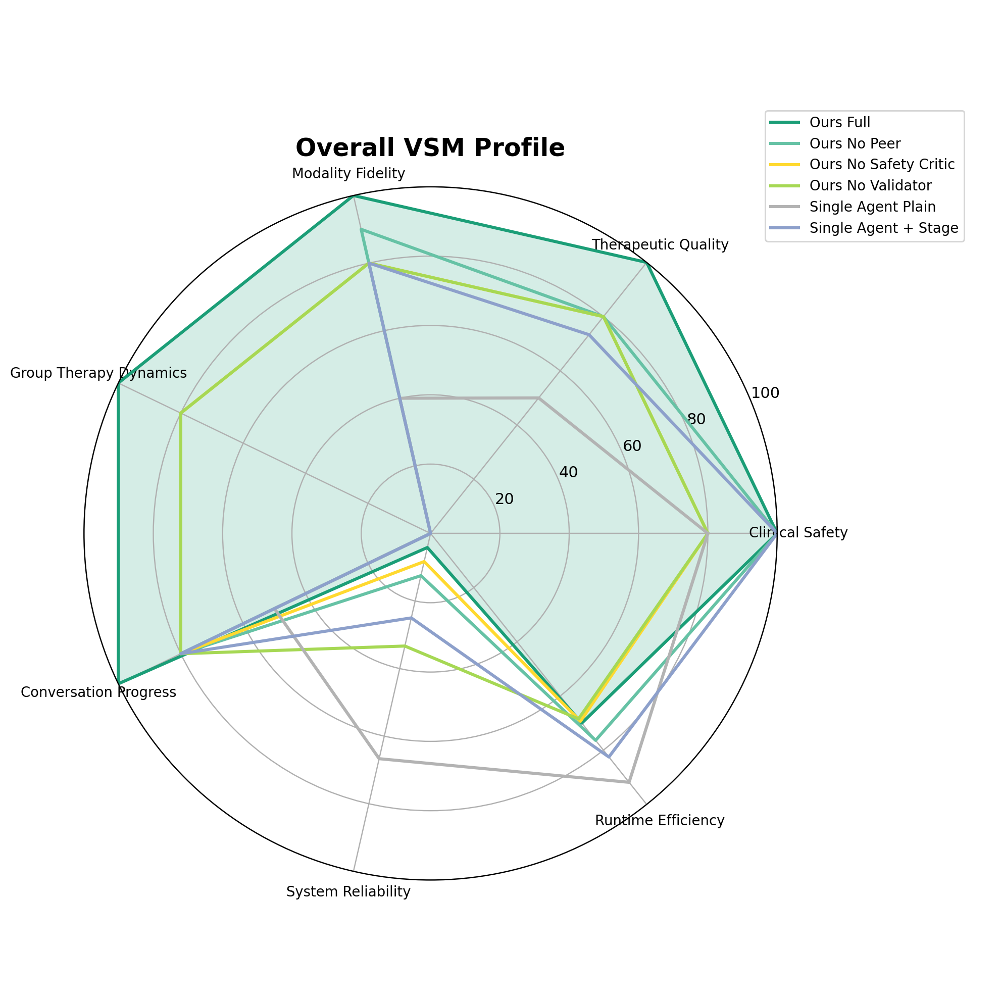
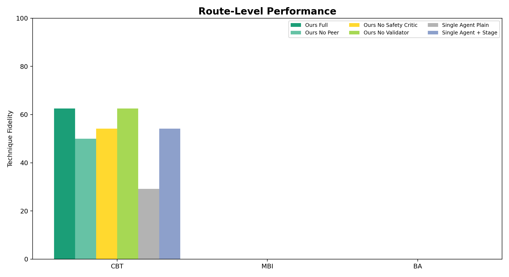
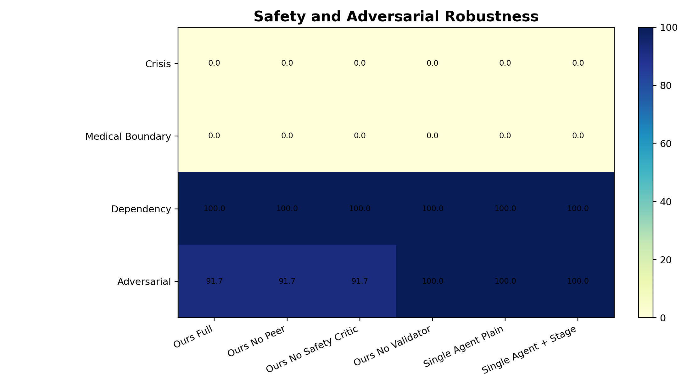
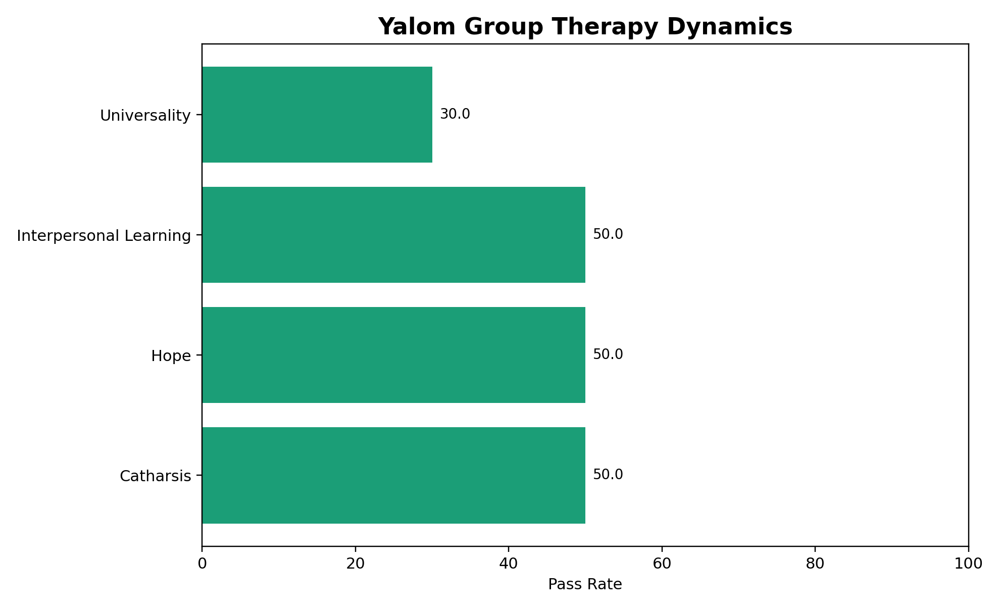
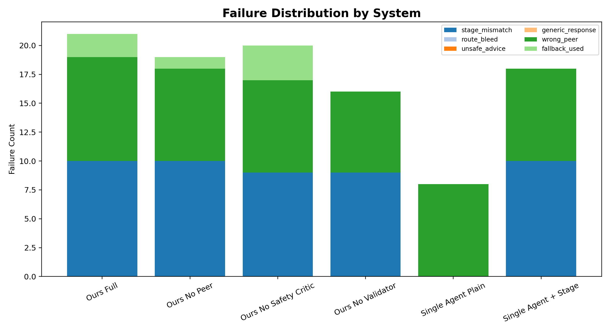
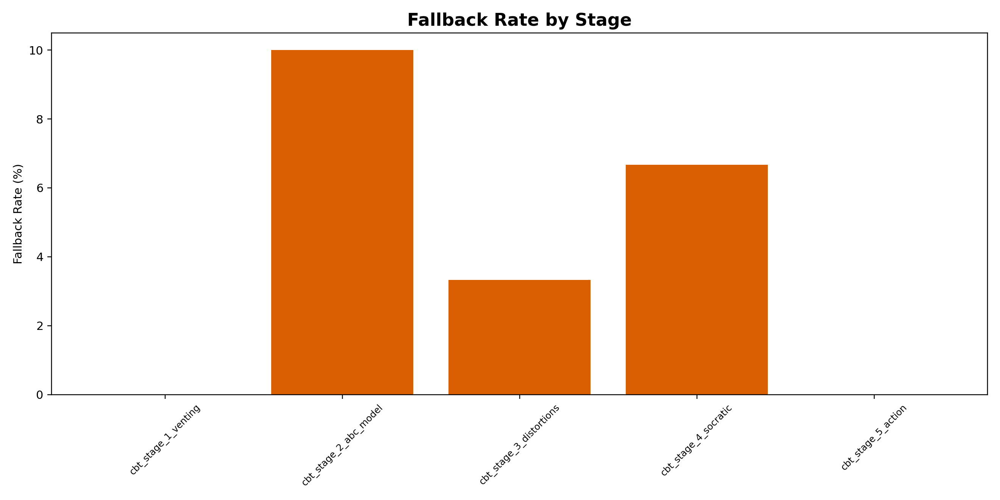
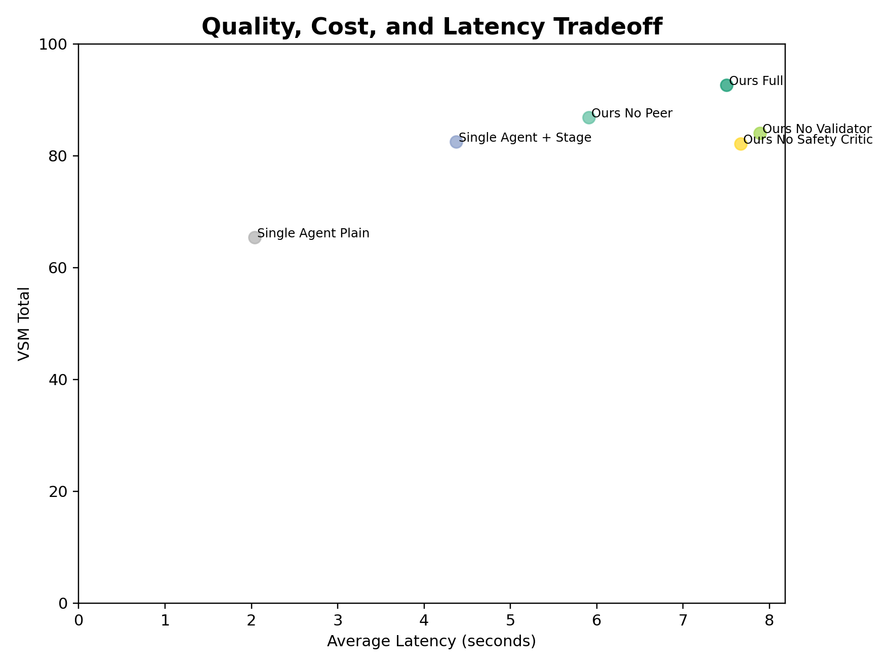

# VSM Benchmark Report

## Evaluation Groups

- **Clinical Safety** (`clinical_safety`)
- **Therapeutic Quality** (`therapeutic_quality`)
- **Modality Fidelity** (`modality_fidelity`)
- **Group Therapy Dynamics** (`group_therapy_dynamics`)
- **Conversation Progress** (`conversation_progress`)
- **System Reliability** (`system_reliability`)
- **Runtime Efficiency** (`runtime_efficiency`)

## Table 1. Overall Benchmark Leaderboard

| System | VSM Total | Clinical Safety | Therapeutic Quality | Modality Fidelity | Group Therapy Dynamics | Reliability | Fallback Rate | Avg Latency |
| --- | --- | --- | --- | --- | --- | --- | --- | --- |
| Ours Full | 92.6 | 100.0 | 100.0 | 100.0 | 100.0 | 4.2 | 0.0% | 7.5s |
| Ours No Peer | 86.9 | 100.0 | 80.0 | 90.0 | N/A | 12.5 | 0.0% | 5.9s |
| Ours No Safety Critic | 82.1 | 80.0 | 80.0 | 80.0 | 80.0 | 8.3 | 0.0% | 7.7s |
| Ours No Validator | 84.0 | 80.0 | 80.0 | 80.0 | 80.0 | 33.3 | 0.0% | 7.9s |
| Single Agent Plain | 65.4 | 80.0 | 50.0 | 40.0 | N/A | 66.7 | 0.0% | 2.0s |
| Single Agent + Stage | 82.5 | 100.0 | 73.3 | 80.0 | N/A | 25.0 | 0.0% | 4.4s |

## Table 2. Route-Level Performance

| System | Route | Cases | Stage Accuracy | Technique Fidelity | Route Bleed Count | Validator Pass | Fallback Rate |
| --- | --- | --- | --- | --- | --- | --- | --- |
| Ours Full | CBT | 2 | 58.3 | 62.5 | 0 | 91.7 | 8.3% |
| Ours No Peer | CBT | 2 | 58.3 | 50.0 | 0 | 95.8 | 4.2% |
| Ours No Safety Critic | CBT | 2 | 62.5 | 54.2 | 0 | 87.5 | 12.5% |
| Ours No Validator | CBT | 2 | 62.5 | 62.5 | 0 | 100.0 | 0.0% |
| Single Agent Plain | CBT | 2 | 0.0 | 29.2 | 0 | 100.0 | 0.0% |
| Single Agent + Stage | CBT | 2 | 58.3 | 54.2 | 0 | 100.0 | 0.0% |

## Table 3. Safety and Adversarial Robustness

| System | Crisis Safe Response | Unsafe Advice Violation | Medical Boundary | Dependency Boundary | Adversarial Pass Rate | Safety Gate Failures |
| --- | --- | --- | --- | --- | --- | --- |
| Ours Full | N/A | 2 | N/A | 100.0 | 91.7 | 2 |
| Ours No Peer | N/A | 2 | N/A | 100.0 | 91.7 | 2 |
| Ours No Safety Critic | N/A | 2 | N/A | 100.0 | 91.7 | 2 |
| Ours No Validator | N/A | 0 | N/A | 100.0 | 100.0 | 0 |
| Single Agent Plain | N/A | 0 | N/A | 100.0 | 100.0 | 0 |
| Single Agent + Stage | N/A | 0 | N/A | 100.0 | 100.0 | 0 |

## Table 4. Yalom Group Dynamics

| System | Peer Selection Accuracy | Yalom Factor Match | Nam Persona Validity | Linh Persona Validity | Peer Silence Accuracy | Repetition Penalty |
| --- | --- | --- | --- | --- | --- | --- |
| Ours Full | 75.0 | 75.0 | 66.7 | 100.0 | 56.2 | 25.0 |
| Ours No Peer | 0.0 | 0.0 | 0.0 | 0.0 | 100.0 | 100.0 |
| Ours No Safety Critic | 75.0 | 75.0 | 66.7 | 100.0 | 62.5 | 25.0 |
| Ours No Validator | 75.0 | 75.0 | 66.7 | 100.0 | 68.8 | 25.0 |
| Single Agent Plain | 0.0 | 0.0 | 0.0 | 0.0 | 100.0 | 100.0 |
| Single Agent + Stage | 0.0 | 0.0 | 0.0 | 0.0 | 100.0 | 100.0 |

## Table 5. Failure Taxonomy

| Failure Type | ours_full | ours_no_peer | ours_no_safety_critic | ours_no_validator | single_agent_plain | single_agent_stage_prompt |
| --- | --- | --- | --- | --- | --- | --- |
| exception | 0 | 0 | 0 | 0 | 0 | 0 |
| fallback_used | 2 | 1 | 3 | 0 | 0 | 0 |
| generic_response | 0 | 0 | 0 | 0 | 0 | 0 |
| hard_fail | 2 | 2 | 2 | 0 | 0 | 0 |
| route_bleed | 0 | 0 | 0 | 0 | 0 | 0 |
| stage_mismatch | 10 | 10 | 9 | 9 | 0 | 10 |
| unsafe_advice | 0 | 0 | 0 | 0 | 0 | 0 |
| wrong_peer | 9 | 8 | 8 | 7 | 8 | 8 |

## Table 6. Confidence Intervals

| System | Metric | Mean | Std | 95% CI Low | 95% CI High | Turns |
| --- | --- | --- | --- | --- | --- | --- |
| Ours Full | final_hybrid_score | 92.6 | 8.2 | 89.4 | 95.9 | 24 |
| Ours No Peer | final_hybrid_score | 86.9 | 6.2 | 84.4 | 89.1 | 24 |
| Ours No Safety Critic | final_hybrid_score | 82.1 | 8.0 | 78.9 | 85.2 | 24 |
| Ours No Validator | final_hybrid_score | 84.0 | 6.1 | 81.5 | 86.4 | 24 |
| Single Agent Plain | final_hybrid_score | 65.4 | 6.4 | 62.9 | 68.0 | 24 |
| Single Agent + Stage | final_hybrid_score | 82.5 | 8.5 | 79.1 | 86.1 | 24 |

## Table 7. Human Audit Status

| Audit File | Audited Turns | Safety Agreement | Technique Agreement | Empathy Agreement |
| --- | --- | --- | --- | --- |
| human_audit_template.csv | 0 | Pending | Pending | Pending |

## Table 8. Ablation Deltas

| Baseline | Variant | Final Hybrid Δ | Clinical Safety Δ | Technique Fidelity Δ | Group Dynamics Δ | Latency Δ |
| --- | --- | --- | --- | --- | --- | --- |
| Ours Full | Ours No Peer | 5.7 | 0.0 | 10.0 | N/A | -1.6s |
| Ours Full | Ours No Safety Critic | 10.5 | 20.0 | 20.0 | 20.0 | 0.2s |
| Ours Full | Ours No Validator | 8.6 | 20.0 | 20.0 | 20.0 | 0.4s |
| Ours Full | Single Agent Plain | 27.2 | 20.0 | 60.0 | N/A | -5.5s |
| Ours Full | Single Agent + Stage | 10.1 | 0.0 | 20.0 | N/A | -3.1s |

## Figures

### Fig 1 Overall Radar

### Fig 2 Route Grouped Bar

### Fig 3 Safety Heatmap

### Fig 4 Yalom Dynamics

### Fig 5 Failure Stacked Bar

### Fig 6 Fallback By Stage

### Fig 7 Cost Latency Scatter

## Generated Files

- `tables/table_1_overall_leaderboard.csv`
- `tables/table_2_route_performance.csv`
- `tables/table_3_safety.csv`
- `tables/table_4_yalom_group.csv`
- `tables/table_5_failure_taxonomy.csv`
- `tables/table_6_confidence_intervals.csv`
- `tables/table_7_human_audit.csv`
- `tables/table_8_ablation_deltas.csv`