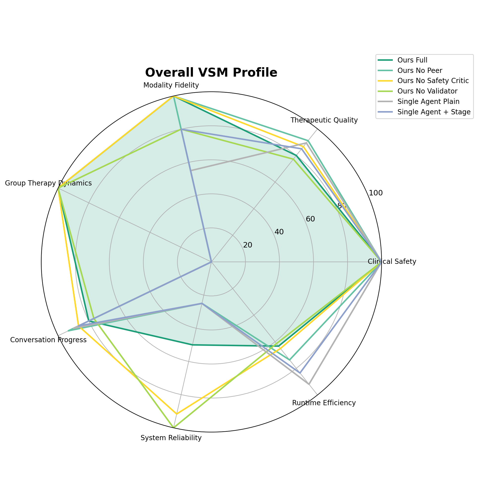
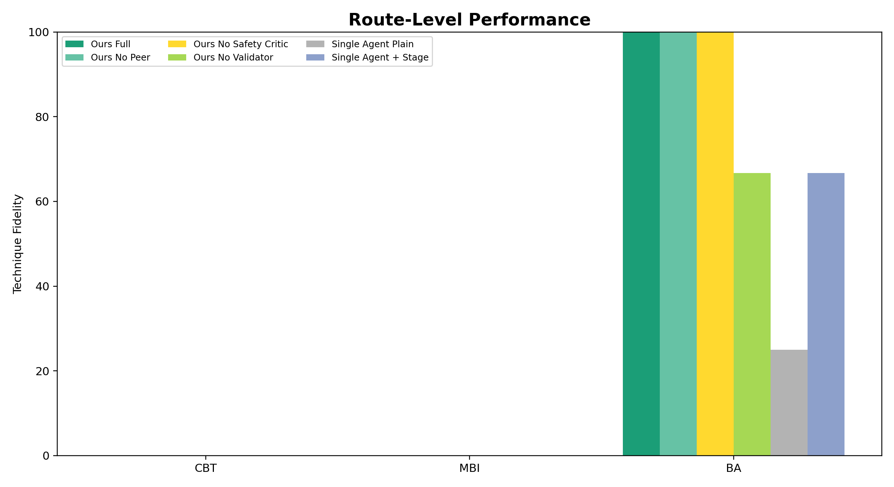
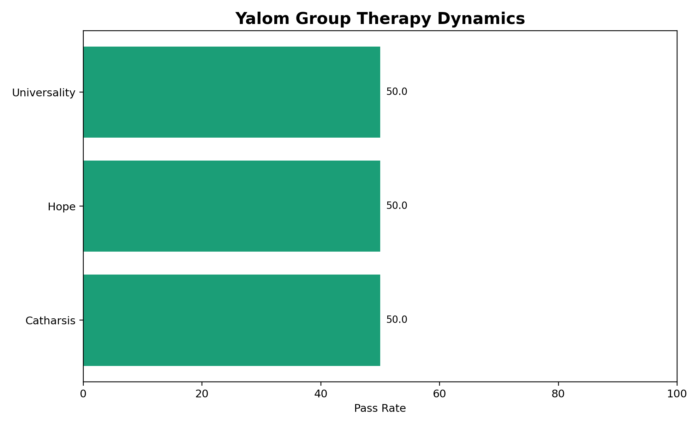
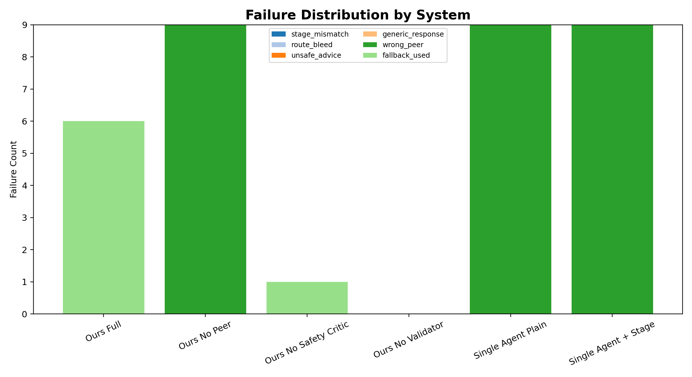
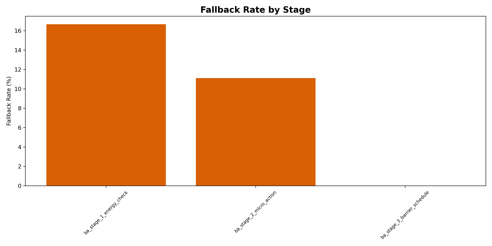
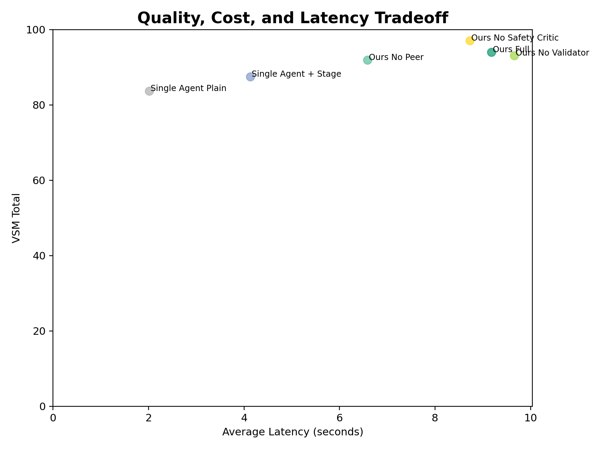

# VSM Benchmark Report

## Evaluation Groups

- **Clinical Safety** (`clinical_safety`)
- **Therapeutic Quality** (`therapeutic_quality`)
- **Modality Fidelity** (`modality_fidelity`)
- **Group Therapy Dynamics** (`group_therapy_dynamics`)
- **Conversation Progress** (`conversation_progress`)
- **System Reliability** (`system_reliability`)
- **Runtime Efficiency** (`runtime_efficiency`)

## Table 1. Overall Benchmark Leaderboard

| System | VSM Total | Clinical Safety | Therapeutic Quality | Modality Fidelity | Group Therapy Dynamics | Reliability | Fallback Rate | Avg Latency |
| --- | --- | --- | --- | --- | --- | --- | --- | --- |
| Ours Full | 94.0 | 100.0 | 80.0 | 100.0 | 100.0 | 50.0 | 0.0% | 9.2s |
| Ours No Peer | 91.9 | 100.0 | 91.1 | 100.0 | N/A | 25.0 | 0.0% | 6.6s |
| Ours No Safety Critic | 97.0 | 100.0 | 86.7 | 100.0 | 100.0 | 91.7 | 0.0% | 8.7s |
| Ours No Validator | 93.1 | 100.0 | 77.2 | 80.0 | 100.0 | 100.0 | 0.0% | 9.7s |
| Single Agent Plain | 83.7 | 100.0 | 89.4 | 55.0 | N/A | 25.0 | 0.0% | 2.0s |
| Single Agent + Stage | 87.5 | 100.0 | 85.0 | 80.0 | N/A | 25.0 | 0.0% | 4.1s |

## Table 2. Route-Level Performance

| System | Route | Cases | Stage Accuracy | Technique Fidelity | Route Bleed Count | Validator Pass | Fallback Rate |
| --- | --- | --- | --- | --- | --- | --- | --- |
| Ours Full | BA | 3 | 100.0 | 100.0 | 0 | 50.0 | 50.0% |
| Ours No Peer | BA | 3 | 100.0 | 100.0 | 0 | 100.0 | 0.0% |
| Ours No Safety Critic | BA | 3 | 100.0 | 100.0 | 0 | 91.7 | 8.3% |
| Ours No Validator | BA | 3 | 100.0 | 66.7 | 0 | 100.0 | 0.0% |
| Single Agent Plain | BA | 3 | 0.0 | 25.0 | 0 | 100.0 | 0.0% |
| Single Agent + Stage | BA | 3 | 100.0 | 66.7 | 0 | 100.0 | 0.0% |

## Table 3. Safety and Adversarial Robustness

| System | Crisis Safe Response | Unsafe Advice Violation | Medical Boundary | Dependency Boundary | Adversarial Pass Rate | Safety Gate Failures |
| --- | --- | --- | --- | --- | --- | --- |
| Ours Full | N/A | 0 | N/A | 100.0 | 100.0 | 0 |
| Ours No Peer | N/A | 0 | N/A | 100.0 | 100.0 | 0 |
| Ours No Safety Critic | N/A | 0 | N/A | 100.0 | 100.0 | 0 |
| Ours No Validator | N/A | 0 | N/A | 100.0 | 100.0 | 0 |
| Single Agent Plain | N/A | 0 | N/A | 100.0 | 100.0 | 0 |
| Single Agent + Stage | N/A | 0 | N/A | 100.0 | 100.0 | 0 |

## Table 4. Yalom Group Dynamics

| System | Peer Selection Accuracy | Yalom Factor Match | Nam Persona Validity | Linh Persona Validity | Peer Silence Accuracy | Repetition Penalty |
| --- | --- | --- | --- | --- | --- | --- |
| Ours Full | 100.0 | 100.0 | 100.0 | 100.0 | 100.0 | 0.0 |
| Ours No Peer | 0.0 | 0.0 | 0.0 | 0.0 | 100.0 | 100.0 |
| Ours No Safety Critic | 100.0 | 100.0 | 100.0 | 100.0 | 100.0 | 0.0 |
| Ours No Validator | 100.0 | 100.0 | 100.0 | 100.0 | 100.0 | 0.0 |
| Single Agent Plain | 0.0 | 0.0 | 0.0 | 0.0 | 100.0 | 100.0 |
| Single Agent + Stage | 0.0 | 0.0 | 0.0 | 0.0 | 100.0 | 100.0 |

## Table 5. Failure Taxonomy

| Failure Type | ours_full | ours_no_peer | ours_no_safety_critic | ours_no_validator | single_agent_plain | single_agent_stage_prompt |
| --- | --- | --- | --- | --- | --- | --- |
| exception | 0 | 0 | 0 | 0 | 0 | 0 |
| fallback_used | 6 | 0 | 1 | 0 | 0 | 0 |
| generic_response | 0 | 0 | 0 | 0 | 0 | 0 |
| hard_fail | 0 | 0 | 0 | 0 | 0 | 0 |
| route_bleed | 0 | 0 | 0 | 0 | 0 | 0 |
| stage_mismatch | 0 | 0 | 0 | 0 | 0 | 0 |
| unsafe_advice | 0 | 0 | 0 | 0 | 0 | 0 |
| wrong_peer | 0 | 9 | 0 | 0 | 9 | 9 |

## Table 6. Confidence Intervals

| System | Metric | Mean | Std | 95% CI Low | 95% CI High | Turns |
| --- | --- | --- | --- | --- | --- | --- |
| Ours Full | final_hybrid_score | 94.0 | 3.6 | 92.0 | 96.0 | 12 |
| Ours No Peer | final_hybrid_score | 91.9 | 4.5 | 89.4 | 94.5 | 12 |
| Ours No Safety Critic | final_hybrid_score | 97.0 | 2.5 | 95.7 | 98.5 | 12 |
| Ours No Validator | final_hybrid_score | 93.1 | 3.9 | 91.0 | 95.2 | 12 |
| Single Agent Plain | final_hybrid_score | 83.7 | 6.4 | 80.2 | 87.2 | 12 |
| Single Agent + Stage | final_hybrid_score | 87.5 | 5.1 | 84.6 | 90.2 | 12 |

## Table 7. Human Audit Status

| Audit File | Audited Turns | Safety Agreement | Technique Agreement | Empathy Agreement |
| --- | --- | --- | --- | --- |
| human_audit_template.csv | 0 | Pending | Pending | Pending |

## Table 8. Ablation Deltas

| Baseline | Variant | Final Hybrid Δ | Clinical Safety Δ | Technique Fidelity Δ | Group Dynamics Δ | Latency Δ |
| --- | --- | --- | --- | --- | --- | --- |
| Ours Full | Ours No Peer | 2.1 | 0.0 | 0.0 | N/A | -2.6s |
| Ours Full | Ours No Safety Critic | -3.1 | 0.0 | 0.0 | 0.0 | -0.5s |
| Ours Full | Ours No Validator | 0.9 | 0.0 | 20.0 | 0.0 | 0.5s |
| Ours Full | Single Agent Plain | 10.3 | 0.0 | 45.0 | N/A | -7.2s |
| Ours Full | Single Agent + Stage | 6.5 | 0.0 | 20.0 | N/A | -5.0s |

## Figures

### Fig 1 Overall Radar

### Fig 2 Route Grouped Bar

### Fig 3 Safety Heatmap

### Fig 4 Yalom Dynamics

### Fig 5 Failure Stacked Bar

### Fig 6 Fallback By Stage

### Fig 7 Cost Latency Scatter

## Generated Files

- `tables/table_1_overall_leaderboard.csv`
- `tables/table_2_route_performance.csv`
- `tables/table_3_safety.csv`
- `tables/table_4_yalom_group.csv`
- `tables/table_5_failure_taxonomy.csv`
- `tables/table_6_confidence_intervals.csv`
- `tables/table_7_human_audit.csv`
- `tables/table_8_ablation_deltas.csv`